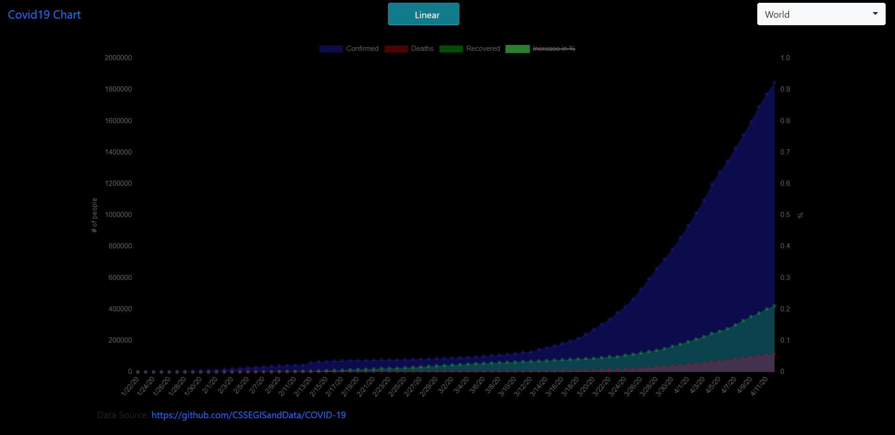

# Covid19-Chart
A simple page for visualisation of covid19 development per country.

View the chart here: https://kuljeet-123.github.io/Covid-19-Chart/

Here is how the chart looks like.

# Third party projects used
* ChartJS (https://www.chartjs.org/)
* Papaparse (https://www.papaparse.com/)
* Bootstrap (https://getbootstrap.com/)
* Bootstrap-select (https://developer.snapappointments.com/bootstrap-select/)
* Bootstraptoggle (https://www.bootstraptoggle.com/)
* JQuery (https://jquery.com/)
* PopperJS (https://popper.js.org/)
